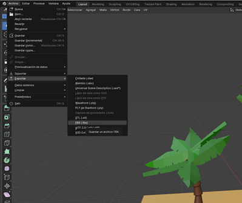
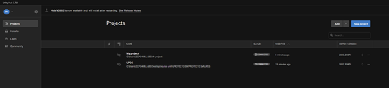
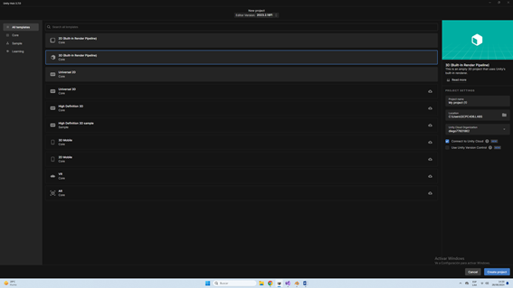
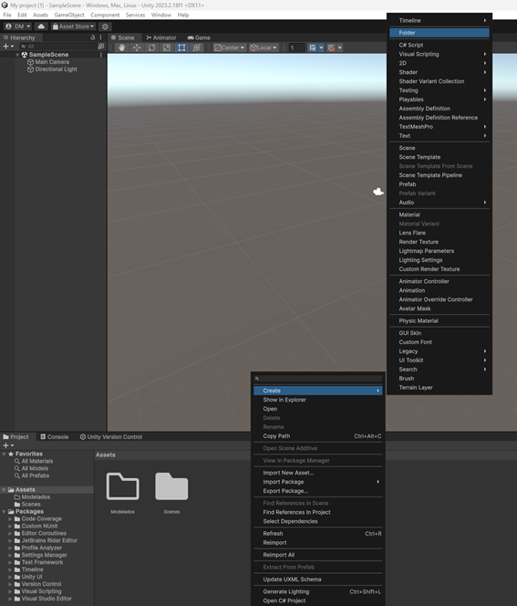
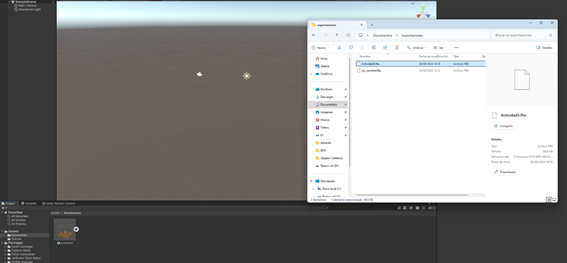
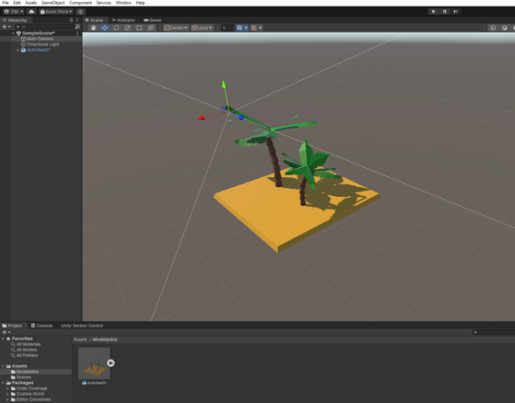
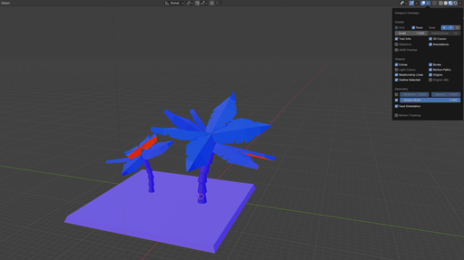
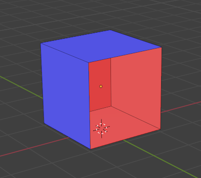
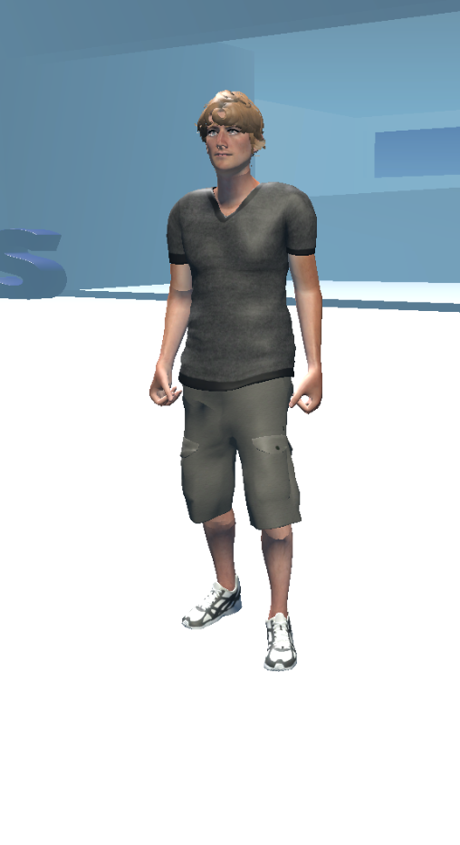
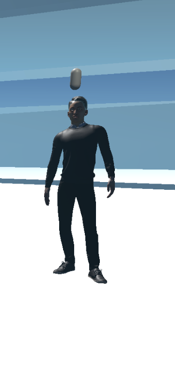

# ¿Cómo Importar de Blender a Unity?

## Paso 1: Exportar el Modelado
Primero, exporta el modelado en formato `.fbx` desde Blender.
 

## Paso 2: Crear un Proyecto en Unity
1. Abre UnityHub y crea un nuevo proyecto.
 

2. Elige `3D (Built-in Render Pipeline)` y presiona `Crear proyecto`.
 

## Paso 3: Añadir los Modelos al Proyecto
1. Crea una carpeta en Unity para añadir los modelados que se agregarán al proyecto.
 

2. Arrastra el modelado dentro de la carpeta que creaste.
 

3. Luego, arrastra el objeto a la escena.
 

**Nota importante**: Antes de importar a Unity, verifica la orientación correcta de las caras.

### ¿Por Qué es Importante?
- **Visualización Correcta**: Unity usa las normales de las caras para determinar cómo se deben mostrar las superficies. Si las normales están mal orientadas, los modelos pueden aparecer invisibles o tener sombreado incorrecto en Unity.
- **Sombreado y Luz**: Una orientación incorrecta puede afectar cómo se aplican las luces y sombras, lo que resulta en un aspecto visual deficiente en tu juego o aplicación.

### Cómo Verificar en Blender
- **Visualización de Normales**: Activa la opción de visualizar normales en el modo de edición (`Overlay > Normals`) para asegurarte de que todas las caras están orientadas correctamente.

### Cómo Corregir en Blender
- **Recalcular Normales**: Selecciona todas las caras y presiona `Shift + N` para que Blender ajuste automáticamente las normales hacia afuera, que es generalmente lo que Unity espera.
- **Invertir Normales**: Si las normales están al revés, selecciona las caras y presiona `Alt + N > "Flip"` para corregir la dirección.

### Consecuencias de No Verificar
- **Errores en Unity**: Modelos con normales mal orientadas pueden aparecer como agujeros, superficies planas incorrectamente o tener problemas de iluminación en Unity.
- **Problemas en el Renderizado**: La visualización en Unity puede ser inexacta, afectando la calidad y el rendimiento del juego o aplicación.

### Consejos Finales
- **Prueba en Unity**: Siempre importa tu modelo a Unity después de ajustar las normales para verificar que se ve y se comporta como esperas.
- **Revisa Antes de Exportar**: Asegúrate de corregir cualquier problema de orientación antes de exportar tu modelo desde Blender para evitar sorpresas en Unity.

Verificar y corregir la orientación de las caras en Blender antes de importar a Unity es esencial para asegurar que tu modelo se vea y funcione correctamente en tu proyecto.

## ¿Cómo Verificar la Orientación Correcta?
1. Haz clic en la flecha de `Overlays` y habilita `Face Orientation`.
 

2. Las caras de color azul son las que son visibles y las caras de color rojo son las que no se pueden ver. En esta imagen podemos ver que las caras están orientadas correctamente.
 

**Otro dato importante**: Todos los objetos 3D por dentro son huecos, por lo que por dentro serán de color rojo.

## ¿Qué es el Formato FBX?
Un archivo FBX es un formato utilizado para intercambiar datos de animación y de geometría 3D. Se pueden usar diferentes programas para abrir, editar y exportar archivos tanto 2D como 3D. Por lo general, este tipo de archivos son especialmente usados en el desarrollo de películas, juegos, realidad aumentada y realidad virtual.

Creado por la empresa canadiense Kaydera, se desarrolló como un software para grabar datos de dispositivos de captura de movimientos, siendo capaz de almacenar todos los datos de escenas de acción, cámara y geometría. Posteriormente pasó a llamarse Filmox, con la extensión de archivo FBX, convirtiéndose en una extensión de archivo para 3D y contenido relacionado con vídeo. Después de pasar por otras empresas, en 2006 finalmente Autodesk se hizo con la propiedad del programa y del formato de archivo FBX.

Si bien el formato FBX es propiedad de Autodesk, son muchas las aplicaciones de modelado y animación que pueden abrir este tipo de archivo. De esta forma, muchos creadores tienen la posibilidad de compartir modelos 3D entre ellos usando este formato, el cual resulta realmente eficiente, pues no en vano es capaz de almacenar modelos como datos binarios.

## ¿Qué es Unity?
Unity es una plataforma de desarrollo de software que se utiliza para crear videojuegos y aplicaciones interactivas. Es uno de los motores de juego más populares y versátiles del mercado, y es conocido por su flexibilidad y potencia.

### ¿Para Qué Sirve Unity?
- **Desarrollo de Juegos**: Unity te permite diseñar, desarrollar y publicar juegos en 2D y 3D. Puedes crear desde simples juegos móviles hasta complejas experiencias en realidad virtual (VR) o aumentada (AR).
- **Creación de Experiencias Interactivas**: Además de juegos, Unity se usa para crear simulaciones, visualizaciones y experiencias interactivas en otros campos como la educación, la arquitectura, y la simulación de entrenamientos.

### Características Clave de Unity
1. **Editor Visual**: Unity ofrece un editor visual que te permite arrastrar y soltar objetos en una escena. Esto facilita el diseño de entornos, personajes y otros elementos sin necesidad de codificar todo desde cero.
2. **Programación en C#**: La programación en Unity se realiza principalmente en C#. Este lenguaje es conocido por ser fácil de aprender y utilizar, y permite a los desarrolladores implementar lógica de juego, controlar el comportamiento de los objetos y más.
3. **Asset Store**: Unity cuenta con una tienda en línea donde puedes encontrar y comprar activos como modelos 3D, texturas, sonidos y herramientas adicionales. Esto puede ahorrar mucho tiempo al no tener que crear todo desde cero.
4. **Multiplataforma**: Uno de los grandes beneficios de Unity es que puedes desarrollar un proyecto una vez y exportarlo a múltiples plataformas, como Windows, macOS, Android, iOS, consolas de videojuegos y la web. Esto te ahorra tiempo y esfuerzo al no tener que adaptar tu proyecto a cada plataforma individualmente.
5. **Realidad Aumentada y Virtual**: Unity ofrece soporte avanzado para la creación de aplicaciones de realidad aumentada y virtual. Tiene herramientas específicas y es compatible con varios dispositivos de VR y AR, lo que te permite crear experiencias inmersivas y envolventes.
6. **Colaboración y Control de Versiones**: Unity facilita el trabajo en equipo mediante la integración con sistemas de control de versiones como Git, lo que permite a varios desarrolladores trabajar en el mismo proyecto sin pisarse los talones.
7. **Física y Animación**: Ofrece sistemas avanzados para simular la física del mundo real (como colisiones y gravedad) y para animar personajes y objetos, haciendo que los movimientos y comportamientos sean más realistas.
8. **Documentación y Comunidad**: Unity tiene una extensa documentación y una gran comunidad de desarrolladores. Esto significa que puedes encontrar muchos tutoriales, foros y recursos para resolver problemas y aprender nuevas técnicas.

### Conclusión sobre Unity
Unity es una herramienta poderosa y flexible que permite a los desarrolladores crear una amplia gama de aplicaciones interactivas, desde juegos hasta simulaciones y experiencias en realidad virtual. Su editor visual intuitivo, soporte multiplataforma y amplias opciones de personalización la convierten en una opción popular tanto para desarrolladores independientes como para grandes estudios de desarrollo.

## ¿Qué es un Personaje en Unity?
 

En Unity, un **personaje** se refiere a cualquier entidad dentro del juego que puede ser controlada o interactuar con el entorno del juego. Los personajes suelen ser protagonistas, antagonistas, o cualquier entidad que juegue un papel activo en la narrativa o en la jugabilidad.

### Características de un Personaje:
- **Control del Jugador:** En muchos casos, un personaje es controlado directamente por el jugador a través de entradas como teclado, ratón, o un controlador de videojuegos.
- **Animaciones:** Los personajes suelen tener animaciones que representan sus movimientos como caminar, correr, saltar, atacar, etc.
- **Colisiones:** Los personajes interactúan con el entorno y otros objetos en el juego, lo que significa que deben tener colisiones para evitar atravesar paredes o el suelo.
- **Scripts:** En Unity, los personajes suelen tener scripts (escritos en C#) que dictan su comportamiento, como la capacidad de moverse, saltar, o reaccionar a eventos en el juego.
- **Componentes Físicos:** Suelen tener componentes como `Rigidbody` para simular física realista y `Collider` para manejar las interacciones físicas.

## ¿Qué es un NPC en Unity?
 

 
Un **NPC** (Non-Playable Character, por sus siglas en inglés) es un tipo de personaje que no es controlado por el jugador, sino por la inteligencia artificial (IA) del juego. Los NPCs sirven para poblar el mundo del juego, realizar tareas, o interactuar con el personaje del jugador.

### Características de un NPC:
- **IA (Inteligencia Artificial):** Los NPCs funcionan a través de scripts de IA que determinan su comportamiento. Esto puede incluir seguir rutas predefinidas, reaccionar al jugador, participar en combates, o simplemente decorar el mundo.
- **Interacción con el Jugador:** Aunque no son controlados por el jugador, los NPCs a menudo interactúan con él, ofreciendo misiones, diálogos, o apoyo.
- **Misiones y Narrativa:** En muchos juegos, los NPCs son fundamentales para avanzar en la historia, proporcionando información o tareas que el jugador debe completar.
- **Fidelidad y Realismo:** Al poblar el mundo del juego, los NPCs ayudan a dar vida al entorno, haciendo que se sienta más inmersivo y realista.

## Diferencias Clave entre Personajes y NPCs en Unity:
- **Control:** Los personajes suelen ser controlados directamente por el jugador, mientras que los NPCs son controlados por la IA del juego.
- **Propósito:** Los personajes son a menudo el foco de la acción y narrativa, mientras que los NPCs sirven para complementar y enriquecer la experiencia del jugador.
- **Interacción:** Los NPCs interactúan con los personajes principales de formas que ayudan a avanzar la historia o a mejorar la jugabilidad, pero no son el centro de la acción.

En resumen, tanto los personajes como los NPCs son esenciales en Unity para crear mundos de juego ricos y dinámicos, pero cumplen roles distintos en la jugabilidad y la narrativa.
